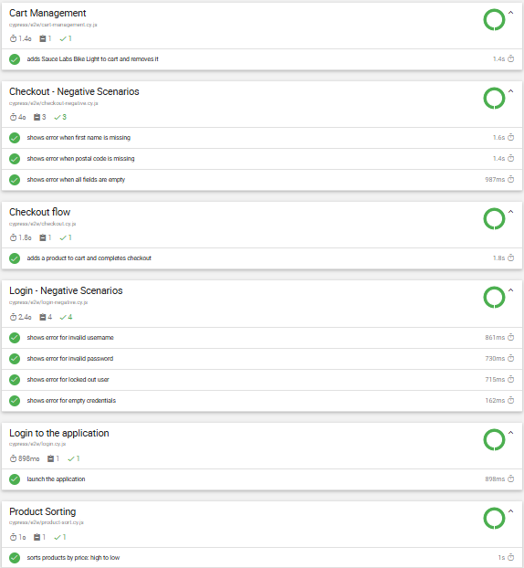

# SauceDemo Test Automation — POC

[](https://github.com/creo-seema/FirstAutomationscript/actions/workflows/cypress.yml)
[](https://creo-seema.github.io/FirstAutomationscript/)

Automated end-to-end testing framework for [SauceDemo](https://www.saucedemo.com/), built with Cypress and the Page Object Model, integrated with GitHub Actions CI/CD, parallel test execution, live-hosted reporting, and automated Microsoft Teams notifications.

## 📊 Latest Test Report

**[➡️ View the live, interactive test report here](https://creo-seema.github.io/FirstAutomationscript/)**

This report updates automatically after every push — no GitHub login required to view it.



## Objective

This Proof of Concept demonstrates a complete, production-style test automation pipeline — from writing tests locally to fully automated execution, public reporting, and team notification, triggered on every code push.

---

## Tech Stack

| Component | Tool |
|---|---|
| Test Framework | Cypress |
| Design Pattern | Page Object Model (POM) |
| Reporting | cypress-mochawesome-reporter |
| Report Hosting | GitHub Pages |
| Parallel Execution | cypress-parallel |
| CI/CD | GitHub Actions |
| Notifications | Microsoft Teams (Workflows webhook) |
| Version Control | Git / GitHub |

---

## Scenarios Automated

**Login**
- Successful login with standard user credentials
- Negative: invalid username, invalid password, locked-out user, empty credentials

**Cart Management**
- Add "Sauce Labs Bike Light" to cart and remove it, verifying cart badge updates correctly

**Product Sorting**
- Sort products by price (High to Low) and verify correct ordering

**Checkout**
- End-to-end purchase flow: login → add "Sauce Labs Backpack" to cart → checkout → order confirmation
- Negative: missing first name, missing postal code, all fields empty

---

## Project Structure

```
FirstAutomationScript/
├── .github/
│   └── workflows/
│       └── cypress.yml              # CI/CD pipeline definition
├── cypress/
│   ├── e2e/
│   │   ├── login.cy.js
│   │   ├── login-negative.cy.js
│   │   ├── cart-management.cy.js
│   │   ├── product-sort.cy.js
│   │   ├── checkout.cy.js
│   │   └── checkout-negative.cy.js
│   ├── PageObjects/
│   │   ├── Login.js
│   │   ├── Inventory.js
│   │   ├── Cart.js
│   │   └── Checkout.js
│   ├── fixtures/                    # Test data
│   └── parallel-weights.json        # Spec weighting for parallel runs
├── cypress.config.js
└── package.json
```

> **Note:** `cypress/reports/` is generated at runtime and is git-ignored — it is not committed to the repository, ensuring every CI run always reflects fresh results.

---

## Running Tests Locally

**Install dependencies:**
```bash
npm install
```

**Run all tests sequentially:**
```bash
npm run test
```

**Run all tests in parallel:**
```bash
npm run cy:parallel
```

**View the report:**
After either run completes, an HTML report is automatically generated at:
```
cypress/reports/html/index.html
```
No manual merge/generate steps required — reporting is fully automatic via the `cypress-mochawesome-reporter` plugin.

---

## CI/CD Pipeline (GitHub Actions)

**Trigger:**
- Every `push` or `pull request` to the `main` branch
- On a schedule — automatically every 2 hours (`0 */2 * * *`), providing continuous regression coverage even without new commits

**Pipeline steps:**
1. Checkout code
2. Set up Node.js
3. Install dependencies
4. Run the full Cypress test suite
5. Extract pass/fail statistics from the generated report
6. Upload the HTML report as a downloadable workflow artifact
7. Deploy the report to **GitHub Pages** — publicly viewable, no GitHub login required
8. Send an automated notification to a Microsoft Teams channel with inline results

**Workflow file:** [`.github/workflows/cypress.yml`](.github/workflows/cypress.yml)

Every code push automatically triggers the full test suite — no manual intervention needed.

---

## Live Test Report

The latest test report is always publicly accessible at:
```
https://creo-seema.github.io/FirstAutomationscript/
```
This updates automatically after every pipeline run — no sign-in required to view it, making it easy to share with stakeholders who don't have GitHub accounts.

---

## Automated Teams Notification

On completion of every pipeline run (pass or fail), a message is posted automatically to a Microsoft Teams channel, showing:
- Repository name
- Total / Passing / Failing / Pending test counts
- Success percentage
- A **"View Full Report"** button linking directly to the live, publicly-hosted report

Test results are visible immediately in Teams — no click-through required to see pass/fail status.

---

## Parallel Execution

Test specs can be executed in parallel using `cypress-parallel`, distributing spec files across multiple threads to reduce overall execution time — configured via `cypress/parallel-weights.json` and the `cy:parallel` npm script.

---

## Key Outcomes of this POC

- ✅ Reusable, maintainable test structure using Page Object Model
- ✅ Positive and negative test coverage across login, cart, sorting, and checkout
- ✅ Fully automated CI pipeline triggered on every push
- ✅ Zero-touch HTML report generation
- ✅ Publicly accessible live report via GitHub Pages — no login required
- ✅ Real-time team visibility via automated Teams notifications with inline stats
- ✅ Parallel execution capability for faster feedback as the suite grows

---

## Next Steps / Scalability

- Expand coverage further (multiple user personas provided by SauceDemo, additional product combinations)
- Add cross-browser execution (Chrome, Firefox, Edge)
